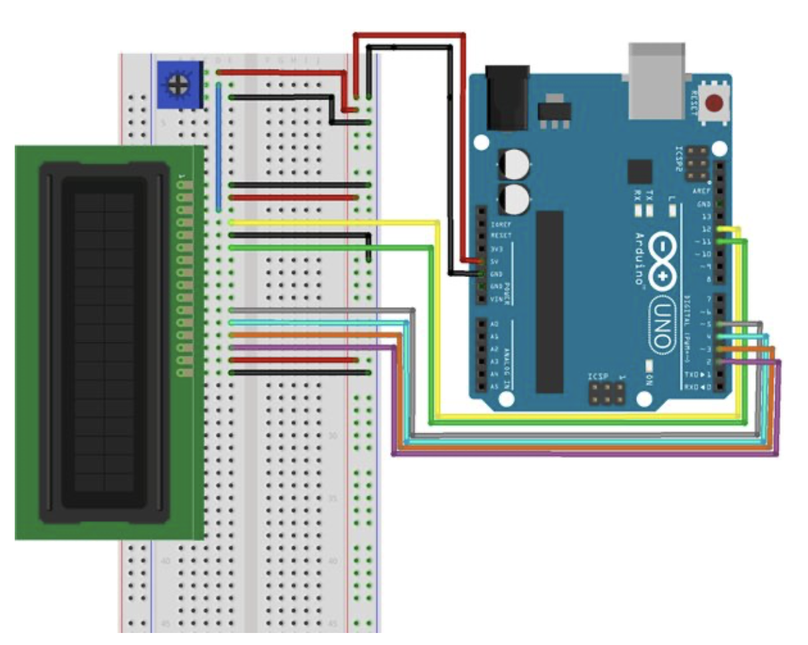

# Arduino-Scoreboard

Arduino Scoreboard is a device & program that allows its users to view the most up to date scores and players stats for all NBA, NFL and MLB teams. As an aspiring engineer who is also an avid NBA fan, I often found it hard to balance my study schedule with the jam-packed NBA season. Checking the score of my favourite team would often lead to hours on Twitter and inevitably watching game itself, all while falling behind on my academic studies. Arduino Scoreboard aims to solve this issue for myself and others alike by enabling users to quickly glance at the screen to know the:
- score of the game
- time remaining (if applicable)
- leading performers on each team as well as their stats

Arduino Scoreboard will also let you know if it is a close game within the last 2 minutes by activating a green LED on the board. This way you can always the watch the fun/competitive games without losing hours of time.

## How it works

Arduino Scoreboard works by using an Arduino Uno, LCD Display, Breadboard, Jumper Wires, and a Potentiometer. Then using PySerial to communicate with the Serial Ports on the Arduino, the `main.py` file will be used to call `ESPNWebScraping.py` periodicially every minute to get the latest scores and stats from ESPN.com by scraping the site.

This data is then formatted with the help of `StringFormatter.py` and sent to `Arduino.py` where it will be written to a Serial Port on the Arduino, which was previously initialized using the `arduinoSetup.ino` file.

## Demo

The following GIF shows a sample run of the Arduino Scoreboard. This GIF outlines some of the key features, such as updating the scores every minute, displaying the leading performers for each team and activating the Green LED when we have a close game with 2 minutes left. (The video has been converted to 7fps and 1.2 speed for space considerations)

## How to use

To use this software on your own Arduino, complete the following steps (this is only one of the many methods to get this working):

- Download this repository to your working directory
- Ensure you have the Anaconda distribution of Python installed, instruction to install can be found [here](https://docs.anaconda.com/anaconda/install/index.html)
- Using Anaconda Prompt, in your working directory, type the following:
    - `conda create --name arduino python=3.7`
    - Type `y` to confirm the environment
    - `conda activate arduino`
    - `conda install pyserial`
- Download the Arduino IDE if you have not already, can be installed [here](https://www.arduino.cc/en/Main/Software)
- Wire your Arduino following the image found below

- Change the Arduino Port in `main.py` under the variable `port` to reflect your own (you can also change your league of choice here by change the `league` variable). If you do not know your port, it can be found following the steps outlined [here](https://www.mathworks.com/help/supportpkg/arduinoio/ug/find-arduino-port-on-windows-mac-and-linux.html)
- Connect your Arduino to your computer and open the `arduinoSetup.ino` file within the Arduino IDE and ensure you are connected to the board
- Now simply cd into the `/python` directory of this project and run `python main.py` and enter the duration you would like for this program to run

**And thats it! Enjoy distraction free score updates.**

